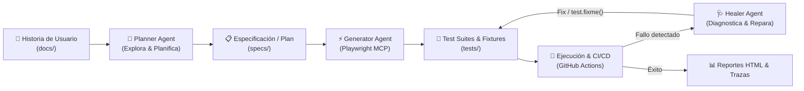

# 🎭 Playwright Agentizado

[](https://github.com/tu-usuario/playwright-agentizado/actions/workflows/playwright.yml)
[](https://playwright.dev/)
[](https://www.typescriptlang.org/)
[](https://nodejs.org/)
[](https://opensource.org/licenses/ISC)

> **Framework de automatización de pruebas End-to-End (E2E) de última generación, impulsado por Playwright y Agentes de Inteligencia Artificial especializados (Planner, Generator y Healer).**

---

## 📋 Tabla de Contenidos

- [Visión General](#-visión-general)
- [Ciclo de Vida del QA Agentizado](#-ciclo-de-vida-del-qa-agentizado)
- [Agentes de Inteligencia Artificial](#-agentes-de-inteligencia-artificial)
- [Estructura del Proyecto](#-estructura-del-proyecto)
- [Patrones y Buenas Prácticas](#-patrones-y-buenas-prácticas)
- [Requisitos Previos](#-requisitos-previos)
- [Instalación y Configuración](#-instalación-y-configuración)
- [Guía de Ejecución de Pruebas](#-guía-de-ejecución-de-pruebas)
- [Integración Continua (CI/CD)](#-integración-continua-cicd)
- [Exploración Autónoma y Reportes](#-exploración-autónoma-y-reportes)
- [Contribución y Convenciones](#-contribución-y-convenciones)

---

## 🌟 Visión General

**Playwright Agentizado** combina la robustez y velocidad de **Playwright** con la capacidad adaptativa de **Agentes de IA** interactuando a través del **Model Context Protocol (MCP)**. 

Este enfoque permite:
1. **Planificar pruebas de forma inteligente**: Exploración autónoma de la aplicación web y generación de planes de prueba detallados.
2. **Generar código resiliente y semántico**: Creación asistida de suites de prueba basadas en localizadores accesibles y tipado estricto con TypeScript.
3. **Auto-reparación (Self-Healing)**: Diagnóstico sistemático de pruebas fallidas, actualización de selectores y marcado controlado de defectos reales de la aplicación (`test.fixme()`).
4. **Desacoplamiento modular**: Separación clara entre datos de prueba (`login-data.ts`), inyección de dependencias (`fixtures/`) y especificaciones vivas (`specs/`).

---

## 🔄 Ciclo de Vida del QA Agentizado

El flujo de trabajo unifica requerimientos de negocio con automatización continua y agentes asistidos por IA:



---

## 🤖 Agentes de Inteligencia Artificial

Los agentes residen en `.github/agents/` y pueden ser ejecutados mediante asistentes con soporte MCP (como GitHub Copilot Workspace, Antigravity o Claude Code):

| Agente | Archivo de Definición | Rol & Capacidades Clave |
| :--- | :--- | :--- |
| **Playwright Test Planner** | [`.github/agents/playwright-test-planner.agent.md`](.github/agents/playwright-test-planner.agent.md) | **Explora y diseña:** Navega la aplicación web usando herramientas MCP (`browser_*`), descubre rutas, analiza árboles de accesibilidad e interacciones, y genera planes exhaustivos con casos felices, negativos y de borde en `specs/`. |
| **Playwright Test Generator** | [`.github/agents/playwright-test-generator.agent.md`](.github/agents/playwright-test-generator.agent.md) | **Codifica:** Toma un plan de pruebas en Markdown, reproduce los pasos interactivamente en el navegador y genera archivos de test en TypeScript limpios, atómicos y basados en buenas prácticas de Playwright. |
| **Playwright Test Healer** | [`.github/agents/playwright-test-healer.agent.md`](.github/agents/playwright-test-healer.agent.md) | **Depura y repara:** Ejecuta `test_debug`, inspecciona fallos mediante snapshots y consola, actualiza selectores dinámicos o aserciones rotas, y si el fallo es un bug genuino del producto, lo marca como `test.fixme()` con justificación técnica. |

---

## 📂 Estructura del Proyecto

```text
playwright-agentizado/
├── .agent/                      # Habilidades y extensiones para agentes (Antigravity)
│   └── skills/playwright-cli/   # Skill para interacción y comandos CLI de Playwright
├── .claude/                     # Habilidades y configuración para Claude Code
├── .github/
│   ├── agents/                  # Definición de prompts e instrucciones de Agentes de IA
│   │   ├── playwright-test-planner.agent.md
│   │   ├── playwright-test-generator.agent.md
│   │   └── playwright-test-healer.agent.md
│   └── workflows/
│       ├── playwright.yml       # Pipeline de CI/CD para ejecución y reporte de pruebas
│       └── copilot-setup-steps.yml # Flujo de preparación para entornos Copilot
├── docs/                        # Historias de usuario y requerimientos funcionales
│   └── historia-login.md        # Especificación de negocio de login y autenticación
├── specs/                       # Planes de prueba vivos (Test Plans generados)
│   ├── login-test-plan.md       # Casos y pasos detallados derivados de las historias
│   └── logins.md                # Matriz de cobertura y trazabilidad
├── tests/                       # Suites de pruebas automatizadas
│   ├── fixtures/
│   │   ├── login-data.ts        # Datos de prueba desacoplados (usuarios, mensajes esperados)
│   │   └── login-fixture.ts     # Extensión de test con inyección de fixtures personalizados
│   ├── login.spec.ts            # Suite principal modularizada usando fixtures
│   ├── loginh.spec.ts           # Prueba auto-curada / validación con aserciones semánticas
│   ├── seed.spec.ts             # Casos de prueba base (LG-01 a LG-06) con test.fixme()
│   └── example.spec.ts          # Pruebas de verificación de conectividad base
├── qa_exploration/              # Evidencia de exploraciones automáticas
│   ├── summary.json             # Resumen de errores de consola, respuestas de red y rutas
│   └── *.png                    # Capturas de pantalla de flujos explorados
├── playwright.config.ts         # Configuración global de Playwright (proyectos, reportes, retries)
├── package.json                 # Dependencias y scripts de ejecución
├── tsconfig.json                # Configuración de compilación TypeScript
└── README.md                    # Documentación principal del framework
```

---

## 🛡️ Patrones y Buenas Prácticas

Este proyecto implementa las mejores prácticas recomendadas por el equipo de Playwright y la comunidad de QA Automation:

### 1. Localizadores Semánticos y Basados en Accesibilidad
Se evita el uso de XPath frágil o clases CSS acopladas al estilo. Se priorizan localizadores accesibles recomendados por Playwright:
```typescript
// ✅ Recomendado: Intención clara y resiliente a cambios de diseño
await page.getByPlaceholder('Ingresa tu email').fill(email);
await page.getByRole('button', { name: 'Iniciar Sesión' }).click();
await expect(page.getByRole('dialog')).toBeVisible();

// ❌ Evitado: Frágil ante cambios cosméticos
await page.locator('.btn-primary.submit-form > span').click();
```

### 2. Custom Fixtures y Desacoplamiento de Datos
Los datos de prueba no están hardcodeados dentro de las pruebas. Se centralizan en [`tests/fixtures/login-data.ts`](tests/fixtures/login-data.ts) y se inyectan a través del fixture [`tests/fixtures/login-fixture.ts`](tests/fixtures/login-fixture.ts):
```typescript
import { test, expect } from './fixtures/login-fixture';

test('permite iniciar sesión con credenciales válidas', async ({ page, loginData }) => {
  const { email, password } = loginData.validUser;
  await page.getByPlaceholder('Ingresa tu email').fill(email);
  await page.getByPlaceholder('Ingresa tu contraseña').fill(password);
  await page.getByRole('button', { name: 'Iniciar Sesión' }).click();
  await expect(page).toHaveTitle(/Laboratorio de Testing/);
});
```

### 3. Aserciones Web-First
Todas las validaciones utilizan aserciones asíncronas de Playwright que esperan automáticamente a que el estado deseado se cumpla:
```typescript
// ✅ Auto-espera reactiva
await expect(loginButton).toBeEnabled();
await expect(errorDialog.getByText(expectedMessage)).toBeVisible();

// ❌ Evitar esperas estáticas
// await page.waitForTimeout(5000); // NUNCA usar
```

### 4. Gestión Transparente de Bugs con `test.fixme()`
Cuando una prueba falla debido a un defecto de la aplicación y no a un error de automatización, se marca con `test.fixme()` justificando el motivo en comentarios. Esto mantiene el pipeline verde mientras se rastrea el problema:
```typescript
test.fixme('LG-05: el formulario actual no bloquea el envío con email vacío', async ({ page }) => {
  // El navegador valida el campo vacío sin atributo `required`.
  // La aplicación actual permite continuar y no muestra validación consistente.
  ...
});
```

---

## ⚙️ Requisitos Previos

Asegúrate de contar con los siguientes componentes en tu entorno local:

- **Node.js**: Versión 18 o superior (recomendado LTS v20+).
- **npm**: Gestor de paquetes incluido con Node.js.
- **Git**: Sistema de control de versiones.

Verifica tu entorno con:
```bash
node -v
npm -v
```

---

## 🚀 Instalación y Configuración

1. **Clonar el repositorio:**
   ```bash
   git clone https://github.com/tu-usuario/playwright-agentizado.git
   cd playwright-agentizado
   ```

2. **Instalar dependencias de Node:**
   ```bash
   npm install
   ```

3. **Instalar los navegadores de Playwright con sus dependencias:**
   ```bash
   npx playwright install --with-deps
   ```

---

## 💻 Guía de Ejecución de Pruebas

El proyecto cuenta con scripts configurados en `package.json` para facilitar las diferentes modalidades de ejecución:

| Comando | Descripción |
| :--- | :--- |
| `npm test` | Ejecuta todas las pruebas en modo headless (todos los navegadores configurados). |
| `npm run test:headed` | Ejecuta las pruebas abriendo la ventana del navegador. |
| `npm run test:ui` | Abre la **interfaz gráfica interactiva de Playwright (UI Mode)** con recarga en vivo y depuración visual. |
| `npm run test:chromium` | Ejecuta las pruebas únicamente en **Chromium**. |
| `npm run test:firefox` | Ejecuta las pruebas únicamente en **Firefox**. |
| `npm run test:webkit` | Ejecuta las pruebas únicamente en **WebKit (Safari)**. |
| `npm run test:debug` | Inicia el inspector paso a paso de Playwright para depurar pruebas. |
| `npm run test:report` | Abre el último reporte HTML generado en el navegador. |

### Ejemplos de uso directo con CLI:

```bash
# Ejecutar un archivo de prueba específico en Chromium con ventana visible
npx playwright test tests/login.spec.ts --project=chromium --headed

# Ejecutar pruebas filtrando por nombre de escenario
npx playwright test -g "credenciales válidas"

# Ejecutar y generar traza completa para análisis
npx playwright test --trace on
```

---

## 🏗️ Integración Continua (CI/CD)

El repositorio incluye un workflow en [`.github/workflows/playwright.yml`](.github/workflows/playwright.yml) que se dispara automáticamente ante eventos `push` y `pull_request` sobre las ramas `main` y `master`.

### Características del pipeline:
- **Ejecución en Ubuntu:** Entorno controlado `ubuntu-latest`.
- **Instalación limpia:** Uso de `npm ci` y cache de navegadores.
- **Tolerancia a fallos:** Configuración de reintentos (`retries: 2` en CI) y ejecución secuencial controlada (`workers: 1`).
- **Publicación de Reportes:** El reporte HTML de Playwright se almacena automáticamente como artefacto (`playwright-report`) durante 30 días, disponible incluso si alguna prueba falla.

---

## 🔍 Exploración Autónoma y Reportes

En la carpeta [`qa_exploration/`](qa_exploration/) se encuentran los artefactos generados durante exploraciones autónomas de aseguramiento de calidad:
- **`summary.json`**: Registro estructurado de llamadas de red fallidas, errores en consola (`consoleErrors`), páginas descubiertas y comportamiento de componentes clave (e.g., carrito de compras).
- **Evidencia visual (`*.png`)**: Capturas de pantalla tomadas en diferentes etapas del recorrido de usuario.

Para consultar el reporte interactivo tras cualquier ejecución:
```bash
npm run test:report
```

---

## 🤝 Contribución y Convenciones

1. **Creación de ramas:** Utiliza la convención `feat/`, `fix/` o `test/` (ej: `feat/checkout-spec`).
2. **Escribir nuevas pruebas:**
   - Define o actualiza la historia en `docs/`.
   - Genera o sincroniza el plan de pruebas en `specs/`.
   - Si creas nuevas suites, utiliza las fixtures de `tests/fixtures/` para mantener la separación de datos y lógica.
3. **Commits semánticos:** Sigue el estándar de conventional commits (`feat:`, `fix:`, `test:`, `docs:`, `chore:`).

---

## 📄 Licencia

Este proyecto está distribuido bajo la licencia **ISC**. Consulta los términos en el archivo `package.json`.
